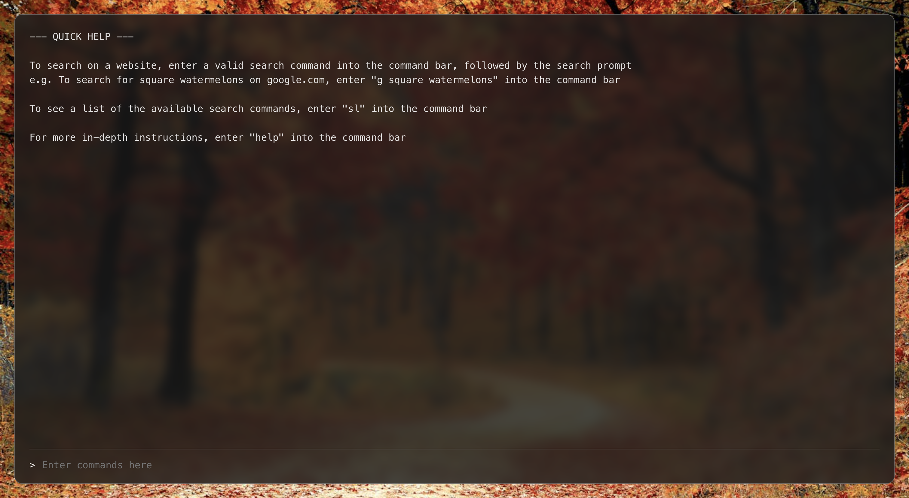

# Search Command Bar
The Search Command Bar is a CLI-inspired Chrome extension that makes searching on websites easier.

## Overview
The Search Command Bar (SCB) Chrome extension takes advantage of URL parameters to make searching on a variety of websites easy. Inspired by the ease of using commands in a terminal, the SCB allows users to search on websites using associated commands. Search prompts are passed as arguments into the search command to construct a URL that takes the user to the website searched with that prompt.

## Features
Features of the Search Command Bar include:
- Searching websites using terminal-esque commands
- Adding custom search commands to search desired websites
- Storing commands using the Chrome extension storage API (or localStorage for [Demo website](https://iii-search-cmd-bar.netlify.app/))
- Using quotation marks to pass in multiple space-separated arguments as a single argument
- A CLI-inspired UI to display command outputs

## Instructions
### Installation
1. Clone this repository
2. Inside the root directory of this repository, run `npm i`, then `npm build`
3. In Chrome, open the `Manage Extensions` menu
4. Turn on Developer Mode for extensions
5. Click the `Load unpacked` button
6. Select the `dist` folder of this repository

### Using the Search Command Bar
1. Open a new tab in Chrome
2. Click the command bar near the bottom or click anywhere on the page
3. Read the initial message for quick help, or enter `help` into the command bar for further detail